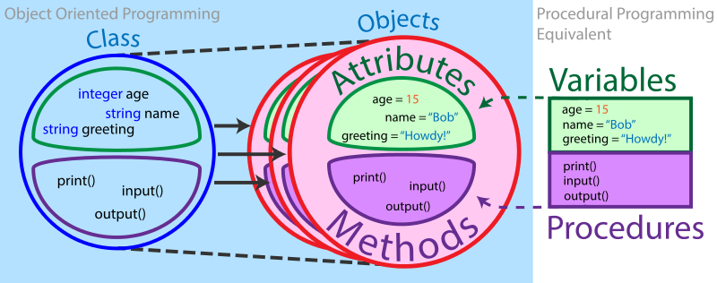
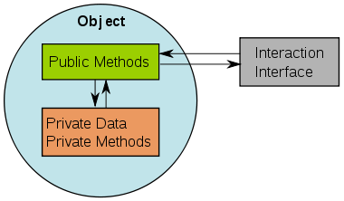
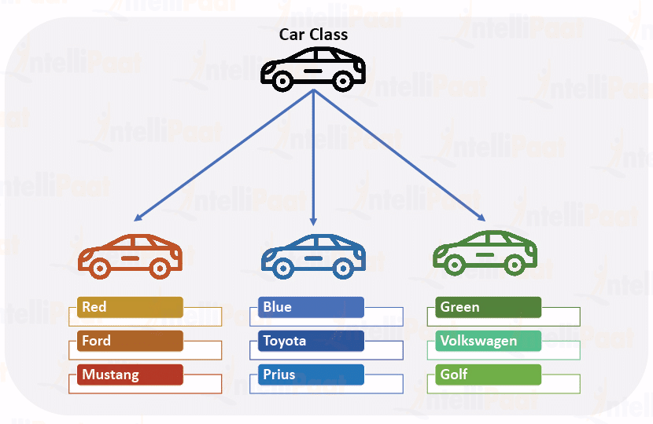
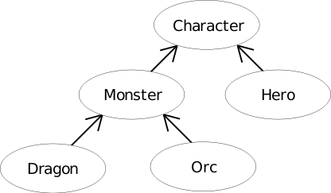

# Object Oriented Programming

## **What is OOP?**

**Object-oriented programming** (OOP) is a common and powerful programming paradigm that heavily incorporates ideas of **abstraction**. Abstraction allows programmers to write code that shows the essential features of a piece of software without including the background details. Some common object-oriented programming languages include Python, Java, Ruby, and C++. Object-oriented programming languages often use classes, which group objects, attributes, and methods together for user-friendly and modular programming.



> _Here is an excerpt from a 1994 Rolling Stone interview where Apple co-founder Steve Jobs explains what object-oriented programming is._
>
> **Jeff Goodell**: Would you explain, in simple terms, exactly what object-oriented software is?
>
> **Steve Jobs**: Objects are like people. They’re living, breathing things that have knowledge inside them about how to do things and have memory inside them so they can remember things. And rather than interacting with them at a very low level, you interact with them at a very high level of abstraction, like we’re doing right here.
>
> Here’s an example: If I’m your laundry object, you can give me your dirty clothes and send me a message that says, “Can you get my clothes laundered, please.” I happen to know where the best laundry place in San Francisco is. And I speak English, and I have dollars in my pockets. So I go out and hail a taxicab and tell the driver to take me to this place in San Francisco. I go get your clothes laundered, I jump back in the cab, I get back here. I give you your clean clothes and say, “Here are your clean clothes.”
>
> You have no idea how I did that. You have no knowledge of the laundry place. Maybe you speak French, and you can’t even hail a taxi. You can’t pay for one, you don’t have dollars in your pocket. Yet I knew how to do all of that. And you didn’t have to know any of it. All that complexity was hidden inside of me, and we were able to interact at a very high level of abstraction. That’s what objects are. They encapsulate complexity, and the interfaces to that complexity are high level.

As Jobs explains, object-oriented programming allows programmers to use code written by other coders without having to know all of the details of the code. This is a vital feature for writing large pieces of software and making software-based products like search engines, apps, social media site, and more. Object-oriented code essentially sets up an agreement between the program and the computer: “If you give me these inputs, I will give you this output.” This allows for easy modular and collaborative programming.

It is good to note that using OOP is entirely optional and most programs can be written without it. A programmer can do a lot just by the use of functions and variables. The primary advantage of using OOP is that it is an extremely useful way of organizing code, especially for very large projects.

## Features of Object-Oriented Programming

There are several features that object-oriented programming depends on.

**Variables or Attributes**: Attributes are characteristics of an object. These are passed in as arguments​ to an object. For example, if there is a `Car` object, it might have attributes such as `color` and `speed`.

**Methods/Procedures**: A method is the equivalent of a function in object-oriented programming. For example, the `Car` object mentioned above might have a method for changing speed, `accelerate`.

**Objects** are an instance of a class. Objects can interact with one another without having to know all the details of their internal code. More than one instance of the same class can exist at any one time, which means there can be multiple objects made from the same class.

**Classes**: A blueprint for creating objects (a particular data structure), providing initial values for state (member variables), and implementations of behavior (member functions/methods).

**Inheritance**: Inheritance describes how the attributes of base cases are inherited by the derived class. A subclass inherits attributes and methods from its parent classes.

**Polymorphism**: The ability to treat several objects of different classes, but that have a common ancestor class, as a data structure of that ancestor class. For example, I might have a list of Animals, which actually contains instances of Cats, Dogs, Rats etc. I can call methods that are defined in the Animal class and treat them all in that generic way.

**Encapsulation**: Encapsulation is when attributes and methods are stored in a single class. The process of providing a public interface to interact with the object while hiding other information inside the object. Encapsulation means that the internal representation of an object is generally hidden from view outside of the object's definition. The main way that encapsulation helps reduce rippling effects of change is by keeping as many of the implementation details private to the class. By limiting the interface only to those members needed to use the class, many changes can be made to the implementation without affecting any code that uses the class. The class can be thought of as a 'capsule' or container for data and operations



***

**P**rocedural programming is about writing procedures or methods that perform operations on the data, while object-oriented programming is about creating objects that contain both data and methods.

Object-oriented programming has several advantages over procedural programming:

* OOP is faster and easier to execute
* OOP provides a clear structure for the programs
* OOP helps to keep the Java code DRY "Don't Repeat Yourself", and makes the code easier to maintain, modify and debug
* OOP makes it possible to create full reusable applications with less code and shorter development time

A **class** is a blueprint for creating **objects** (a particular data structure), providing initial values for state (member variables or attributes), and implementations of behavior (member functions or methods).

The user-defined objects are created using the `class` keyword. The class is a blueprint that defines a nature of a future object. An **instance** is a specific object created from a particular class. Classes are used to create and manage new objects and support **inheritance**—a key ingredient in object-oriented programming and a mechanism of reusing code.



The image above shows how a `Car` object can be the template for many other `Car` instances. In the image, there are three instances: `ford`, `toyota`, and `volkswagen`. Here, we will make a new class called `Car`, that will structure a `Car` object to contain information about the car’s model, the color, how many passengers it can hold, its speed, etc. A class can define types of operations, or methods, that can be performed on a `Car` object. For example, the `Car` class might specify an `accelerate` method, which would update the `speed`attribute of the car object.



A class is a way of organising information about a type of data so a programmer can reuse elements when making multiple instances of that data type—for example, if a programmer wanted to make three instances of `Car`, maybe a BMW, a Ferrari, and a Ford instance. The `Car` class would allow the programmer to store similar information that is unique to each car (they are different models, and maybe different colours, etc.) and associate the appropriate information with each car.

## Classes

### Creating A Class

In Javascript, classes are declared by the keyword `class` followed by the class name. A `class` statement defines a new class just as a `def` statement defines a new function.

The following example will define a simple class that defines a person.

```javascript
class Person {
} // The class definition fits inside this pair of braces
```

### **The Constructor Method**

After declaring the class name, a programmer must define a **constructor** method. In **Javascript**, this is denoted `constructor`. The `constructor` function takes any number of arguments as desired by the programmer. For this example that describes a person, the programmer wants to know each persons name, age, gender and interests.

The name `constructor()` is used for the "constructor method" for the class. While a class is a blueprint for a new data type, the programmer still needs to create values of this data type in order to have something that can store in variables or pass to functions.

When called, the constructor creates the new object, runs the code in the constructor, and returns the new object.

So far, we have

```javascript
class Person {
  constructor(name, age, gender, interests) {
  }
}
```

The above defines a method for the person class. Methods are used for functions that belong to a class.

**Variables and the Body of the `constructor` Method**

To access the arguments and associate them with a particular instance of the class, within the **`constructor`** method, create variables for each argument​ like this: `this.variableName = variableName`.

Another component associated with classes are **attributes**. Attributes are characteristics of an object. The method called `constructor()` is used to initialise the attributes of an object. Just as **methods** are functions defined in a class, attributes are variables defined in a class.

Each method in a class definition begins with a reference to the instance object. By convention, this is named 'this'.

In Javascript, the first parameter for methods is `this`. The `this` parameter is used to create member variables. Inside a class, we initialise any variables that might have different values depending on the specific instance of the class as `this.VariableName`. For the car example, we might want to access the `color` variable of `car_1` and the `color` variable of `car_2` and in order to assign each car its own `color` value, we need the `this`.

The body of the constructor function for the example of person is as follows:

```javascript
this.name = name;
this.age = age;
this.gender = gender;
this.interests = interests;
```

This code creates member variables for the object that is created by the constructor. Member variables will begin with `this` to show that they are member variables belonging to the object, and not just regular local variables in the method.

All put together, the class to describe a person looks like this:

```javascript
class Person {
  constructor(name, age, gender, interests) {
    
    this.name = name;
    this.age = age;
    this.gender = gender;
    this.interests = interests;
  }
}
```

### **Creating an Instance**

An **instance** is a specific object created from a particular class. To create instances of a class, call the class using the class name and pass in whatever arguments its `constructor` method accepts—in this example, the `constructor` method takes `name`, `age`, `gender and interests.`

```javascript
let han = new Person('Han Solo', 25, 'male', ['Smuggling']);

```

Here we create a new instance of the `person` class. Or, in other words, we instantiate the `person` class.

## Variables

### **Instance Variables**

An **instance variable** is a variable that is associated with a specific instance of a class. For example, `speed` can be an instance variable for a `Car` object, and there can be two instances of `Car`, a red car and a blue car, and each car can have its own speed. Even though the variables are named the same across instances, the values are independent and changing the speed of the blue car will not affect the speed of the red car.

### **Class Variables**

A **class variable** refers to attributes that are simply variables of a class. They can be used like any other variable in that they are set when the class is created and can be updated by either method within the class or elsewhere in the main part of the program. These variables are shared among all instances of the class, and changing this variable will affect all instances of the class.

A `class` declaration basically describes a framework for what should exist. If a single general construction plan for any house is a class, an instance would be an actual specific type of house with its own attributes but still following the general structure.

```javascript
let han = new Person('Han', 'Solo', 25, 'male', ['Smuggling']);
han.greeting();
// Hi! I'm Han
```

## Object Variables and Scope

In object-oriented programming, methods and variables have various **scope**. Scope means that the method or variable may or may not be directly accessible to other objects or classes. Classes that do not have instances may be accessible to the system.

**Class Scope**: Class variables and class methods are associated with a class. An instance of the class (object) is not required to use these variables or methods. Class methods cannot access instance variables or methods, only class variables and methods.

**Instance Scope**: Instance variables and instance methods are associated with a specific object. They can access class variables and methods.

**Private Scope**: Private variables and private methods are only accessible to the object they are contained in. So if something goes wrong with that, there is usually only one source file to look at. If you have a million lines of code in your project, but your classes are kept small, this can reduce your bug tracking effort by a large factor.

**Public Scope**: Public variables and public methods are accessible outside the object they are contained in, which for practical considerations means "potentially anywhere." If something goes wrong with a public field, the culprit can be anywhere, so in order to track down the bug, you may have to look at quite a lot of code

**Protected Scope**: Protected variables and protected methods are accessible by the class they are in and inheriting classes (subclasses).

**Encapsulation**: The process of providing a public interface to interact with the object while hiding other information inside the object. Encapsulation means that the internal representation of an object is generally hidden from view outside of the object's definition. The main way that encapsulation helps reduce rippling effects of change is by keeping as many of the implementation details private to the class. By limiting the interface only to those members needed to use the class, many changes can be made to the implementation without affecting any code that uses the class

## Inheritance, Superclasses, and Overriding Methods

**Inheritance** is basically the idea that different classes can have similar components, and in order to avoid repeating code, inheritance is used to link parent classes to descendant classes. For example, in a fantasy story, there are heroes and monsters but both the heroes and the monsters are characters. And both dragons and orcs are monsters. Though dragons and orcs are different monsters, they share some qualities that a reader might want to know: they both have a colour, they both have a size, they both have enemies. Orcs might have characteristics that dragons do not; for example, what kind of weapon does the orc carry? To allow for classes to share some key information before getting very specific into a descendant object, inheritance allows the classes to share information relevant to multiple parts of the code.



Object-oriented programming allows classes to inherit commonly used state and behavior from other classes. In this example, `Teacher` is the **subclass** of `Person`, and `Person` is a **superclass** of `Teacher`

```javascript
class Teacher extends Person {
  constructor(first, last, age, gender, interests, subject, year) {
    super(first, last, age, gender, interests);
  }
}
```

What this is effectively saying is, "A `Teacher`is the same as a `Person`," with some additional methods and member variables.

Inheritance allows code to be reused and reduces the complexity of a program. The derived classes (descendants) override or extend the functionality of base classes (ancestors).

Be aware, inheritance can be abused. Be certain that any change or update to the `Person` class would also be an acceptable update to the `Teacher` class and every other subclass that `Person` has.

Inheritance describes how the attributes of parent classes are inherited by the child class. A subclass inherits attributes and methods from its parent classes.

## Methods

A **method** is the equivalent of a function in object-oriented programming. A noun is to a verb what a variable is to a method — the methods are the actions that perform operations on a variable. A method accepts parameters as arguments, manipulates these, and then produces an output when the method is called on an **object**. Methods are similar to functions, but methods are also classified according to their purpose in the class design. In classes, variables are called **attributes**, so methods often operate on attributes.

Methods are like functions or subroutines or algorithms that are used inside classes. Methods can include for loops, while loops, and any other programming components. Methods can manipulate attributes associated with an object.

### Constructor

A constructor is used to instantiate a class, which is what effectively creates an object (remember that a class is a blueprint for an object, and an object is an instance of a class). They are usually either named after the class (such as in Java and C#) or named after a keyword (such as in Python and Ruby). The parameters of a constructor method, when present, are usually the initial values to be assigned to some or all of the attributes of that object. You've seen an example of a constructor which assigns attributes in the example above but here it is again

```javascript
class Person {
  constructor(name, age, gender, interests) {
  }
}
```

### Implementation Method

The implementation method is the one that most resembles a standard procedural function. Like the name suggests, this is a method that will actually implement functionality to the object. These are the typical methods a programmer would write into their code. This is usually done by manipulating the object's attributes and provides some output (or alters some internal attribute in a specific way without providing any immediate output, etc.).

## Example Code



## OCR Specification (Page 42 for OOP Specific Pseudocode)


